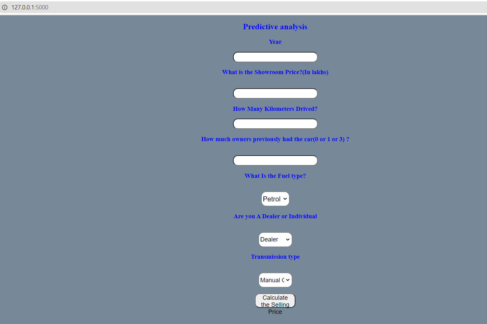

# Car-Price-Prediction

## Vehicle dataset
Used Cars data form websites. 

This dataset contains information about used cars.
This data can be used for a lot of purposes such as price prediction to exemplify the use of linear regression in Machine Learning.
The columns in the given dataset are as follows:

name
year
selling_price
km_driven
fuel
seller_type
transmission
Owner

## Aim 

Predict the Sell Price for the car. 

# To deploy on Heroku you need two things:
+ requirements.txt file
+ Procfile

**How to Get the requirements.txt file**

# Method 1: using pip
pip freeze > requirements.txt

# Method 2: using pipreqs (recommended)
+ First install pipreqs
pip install pipreqs
+ Second use pipreqs to get the requirements.txt file of any project
pipreqs yourmlapp_folder

**For the  procfile can I simply use: web: gunicorn app:app?**
+ What to Put inside the Procfile
+ web: gunicorn app:app

**should the static and templates folder remain the same for deployment as the one we prepared during Productionization?**
+ Yes,  you will have to push them too to github

**Procfile**
For Heroku you need to say which is the first file bascially you need to execute. 
web:gunicorn app: app
Which is your file of Flask you want to run first? app.py

**setup.sh**
Script program for bash that helps us to execute code with respect to requirement.txt. 
It helps us to setup environment for streamlit library. 

**Flasgger**
This will help us to create the UI part in a much feasible and easy way. It won't be that decorative but it would be a good front end web app. In Flasgger, Swagger will automatically generate the frontend UI part. 

In this repository, we have performed implementation of end To end kaggle machine learning project for car price prediction with deployment.


### 🟢 For EDA + Model Building, please refer to: Car Price Prediction.ipynb
### 🟢 For Model Deployment, please refer to app.py


### 🔵 Creating the flask API

```
app = Flask("__name__")
```

The loadPage method calls our home.html.
```
@app.route("/")
def loadPage():
	return render_template('home.html', query="")
```

The predict method is our POST method, which is basically called when we pass all the inputs from our front end and click SUBMIT.
```
@app.route("/", methods=['POST'])
def predict():
```
  
The run() method of Flask class runs the application on the local development server.
```
app.run()
```


Yay, our model is ready, let’s test our bot.
The above given Python script is executed from Python shell.

Go to Anaconda Prompt, and run the below query.
```
python app.py
```


Below message in Python shell is seen, which indicates that our App is now hosted at http://127.0.0.1:5000/ or localhost:5000
```
* Running on http://127.0.0.1:5000/ (Press CTRL+C to quit)
```


HERE'S HOW OUR FRONTEND LOOKS LIKE:


